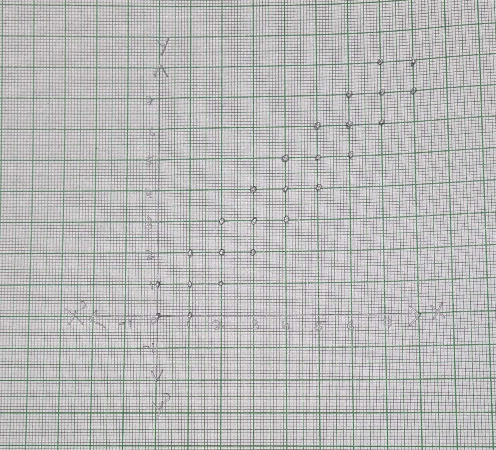

# Problem 1
We have 12 batteries, of which 3 are new, 4 used and 5 defective. We choose 2 batteries from them without replacement.  
$X$ is the number of new batteries chosen and $Y$ the number of used batteries chosen.  

## Part 1
We want to find $f_{XY}(x,y)$, *i.e.* $P(X = x, Y = y)$. We can do this by noting that the total number of ways to pick 2 batteries from 12 is ${12 \choose 2}$, and the total number of ways to pick $x$ new and $y$ used ones is ${3 \choose x} \cdot {4 \choose y}$.  
Thus we have
$$f_{XY}(x,y) = \frac{{3 \choose x} \cdot {4 \choose y}}{{12 \choose 2}}, x+y \leq 2.$$

## Part 2
We want to find $E[X]$, for which we need $f_X(x)$. This can be straightforwardly derived as
$$f_X(x) = \frac{{3 \choose x}}{{12 \choose 2}},$$
from which we get
$$\begin{split}
E[X] &= 0 \cdot \left(\frac1{{12 \choose 2}}\right) + 1 \cdot \left(\frac3{{12 \choose 2}} \right) + 2 \cdot \left(\frac3{{12 \choose 2}}\right) \\
&= \frac{9}{66} = \frac{3}{11}.\end{split}$$

# Problem 2
## Part 1
$$\begin{split}
\Gamma\left(\frac72\right) &= \left(\frac52\right)\Gamma\left(\frac52\right) \\
&= \left(\frac52\right)\left(\frac32\right)\Gamma\left(\frac32\right) \\
&= \left(\frac52\right)\left(\frac32\right)\left(\frac12\right)\Gamma\left(\frac12\right) \\
&= \frac{15\sqrt{\pi}}8. \end{split}$$

## Part 2
$$\begin{split}
I &= \int_0^\infty x^7 e^{-5x}dx \\
&= \int_0^\infty \left(\frac{t}{5}\right)^7 e^{-5\left(\frac{t}{5}\right)} d\left(\frac{t}{5}\right) \\
&= \frac{1}{5^8} \int_0^\infty t^7 e^{-t} dt \\
&= \frac1{5^8} \Gamma(8) \\
&= \frac{7!}{5^8}. \end{split}$$

# Problem 3
We have that $Q$ is a CRV with PDF
$$f_Q(q) = \begin{cases}
6q(1-q) & q \in [0, 1] \\
0 & \text{otherwise}, \end{cases}$$
and that $X$ is such that
$$P(X = 1 \mid Q = q) = q.$$

We need to find $f_{Q \mid X}(q \mid x)$ for $x \in \{0,1\}$ and all $q$.  

First, we will find $f_X$. Consider $P(X = 1)$; we can find it as follows:
$$\begin{split}
P(X = 1) &= \sum_q P(X = 1 \mid Q = q)P(Q = q) \\
&= \int_0^1 P(X = 1 \mid Q = q)f_Q(q) dq \\
&= \int_0^1 6q^2(1-q)dq \\
&= 6\left[\frac{q^3}{3} - \frac{q^4}{4}\right]_0^1 \\
&= 6 \cdot \left(\frac1{12}\right) = \frac12. \end{split}$$

Since $X$ is a Bernoulli RV, we know this means that $P(X = 0) = \frac12$. Now, we can calculate
$$\begin{split}
f_{Q \mid X}(q \mid x) &= P(Q = q \mid X = x) \cdot \frac1{dq} \\
&= \frac{P(X = x \mid Q = q) \cdot P(Q = q)}{P(X = x) dq}\end{split}$$

For $X = 1$, we have
$$f_{Q \mid X}(q \mid X = 1) = \frac{q \cdot 6q(1-q)}{\frac12} = 12q^2(1-q),$$
and for $X = 0$,
$$f_{Q \mid X}(q \mid X = 0) = \frac{(1-q) \cdot 6q(1-q)}{\frac12} = 12q(1-q)^2,$$

since $P(X = x) = \frac12$ for all $x \in \{0,1\}$.

# Problem 4
The surface has an infinite number of parallel lines with spacing $d$, and we throw a needle of length $l$ randomly on it. We need to find the probability that the needle intersects a line.  
Since the surface is infinite, we consider the space between two adjacent parallel lines. This is sufficient as the surface merely consists of a number of such spaces.  

We will assume that the angle $\Theta$ which the needle makes with the vertical and the distance $R$ from the *lower* line (to the centre of the needle) are uniform RVs, *i.e.*,
$$f_\Theta(\theta) = \frac{1}{2\pi},$$
$$f_R(r) = \frac{1}{d}.$$

Let the event of the needle intersecting a line be called $N$. We will first find $f_{N \mid R}$ and then find $P(N)$ from this.  

Suppose that $R = r$. Now there are three cases:  
If $r \leq \frac{l}{2}$, then for the needle to intersect the lower line, the maximum value of $\Theta$ is $\cos^{-1}\left(\frac{r}{\frac{l}{2}}\right)$. This could be in either direction; therefore we have
$$\begin{split}
P\left(N \mid R \leq \frac{l}{2}\right) &= P\left(-\cos^{-1}\left(\frac{r}{\frac{l}{2}}\right) \leq \Theta \leq \cos^{-1}\left(\frac{r}{\frac{l}{2}}\right)\right) \\
&= \frac{2\cos^{-1}\left(\frac{2r}{l}\right)}{2\pi} \\
&= \frac{\cos^{-1}\left(\frac{2r}{l}\right)}{\pi}. \end{split}$$
If $r \geq d-\frac{l}{2}$, then we obtain an identical result with the distance to the *upper* line, *i.e.*,
$$P\left(N \mid R \geq d-\frac{l}{2}\right) = \frac{\cos^{-1}\left(\frac{2(d-r)}{l}\right)}{\pi}.$$
If $\frac{l}{2} < r < d-\frac{l}{2}$, then it is not possible for the needle to intersect either of the lines, as its centre is more than $\frac{l}{2}$ away from each of them. Thus we have
$$P\left(N \mid \frac{l}{2} < R < d-\frac{l}{2}\right) = 0.$$

Note that the above three cases are mutually exclusive and exhaustive, since we are given that $l < d$.  
Thus we have $f_{N \mid R}$ for all values of $R$. We can now integrate to find $P(N)$ as follows.
$$\begin{split}
P(N) &= \sum_r P(N \mid R = r) P(R = r) \\
&= \int_0^d P(N \mid R = r) f_R(r) dr \\
&= \int_0^{\frac{l}{2}} \frac{\cos^{-1}\left(\frac{2r}{l}\right)}{\pi}\frac{dr}{d} \\
&+ \int_{d-\frac{l}{2}}^d \frac{\cos^{-1}\left(\frac{2(d-r)}{l}\right)}{\pi}\frac{dr}{d} \\
&+ \int_{\frac{l}{2}}^{d-\frac{l}{2}} 0 \frac{dr}{d} \\
&= I_1 + I_2 + 0. \end{split}$$

Now, for
$$I_1 = \int_0^{\frac{l}{2}} \frac{\cos^{-1}\left(\frac{2r}{l}\right)}{\pi}\frac{dr}{d},$$
we can take the constants out and substitute $x = \frac{2r}{l}$, which will give us
$$I_1 = \frac{1}{\pi d} \frac{l}{2} \int_0^1 \cos^{-1}(x)dx.$$

Similarly, for
$$I_2 = \int_{d-\frac{l}{2}}^d \frac{\cos^{-1}\left(\frac{2(d-r)}{l}\right)}{\pi}\frac{dr}{d},$$
we can take the constants out and substitute $x = \frac{2(d-r)}{l}$, which gives us
$$\begin{split}
I_2 &= \frac{1}{\pi d} \int_1^0 \cos^{-1}(x)d\left(-\frac{l}{2}x\right) \\
&= \frac{1}{\pi d}\frac{l}{2} \int_0^1 \cos^{-1}(x)dx. \end{split}$$

Thus we have a total of
$$\begin{split}
P(N) &= \frac{2}{\pi d}\frac{l}{2} \int_0^1 \cos^{-1}(x)dx \\
&= \frac{l}{\pi d} \left[x\cos^{-1}(x) - \sqrt{1-x^2}\right]_0^1 \\
&= \frac{l}{\pi d} \left[(1 \cdot \cos^{-1}(1) - 0) - (0 \cdot \cos^{-1}(0) - 1)\right] \\
&= \frac{l}{\pi d} \left[(0 - 0) - (0 - 1)\right] \\
&= \frac{l}{\pi d}. \end{split}$$

# Problem 5
We have two RVs $X, Y$ with range
$$R_{XY} = \{(i,j) \in \mathbb{Z}^2 \mid i, j \geq 0, |i-j| \leq 1\},$$
and joint PMF
$$P_{XY}(i,j) = \frac{1}{6 \cdot 2^{\min(i,j)}}, (i,j) \in R_{XY}.$$

## Part 1
The range $R_{XY}$ is represented graphically in the figure.

## Part 2
We need to find the marginal PMFs $P_X(i)$ and $P_Y(j)$.  

For $P_X(i)$, we must deal with the cases $i = 0$ and $i \geq 1$ separately.  
If $i = 0$, then $j$ can only take the values 0 and 1. Summing over these, we get
$$\begin{split}
P_X(0) &= P_{XY}(0,0) + P_{XY}(0,1) \\
&= \frac{1}{6 \cdot 2^0} + \frac{1}{6 \cdot 2^0} \\
&= \frac13. \end{split}$$
If $i \geq 1$, then $j \in \{i-1,i,i+1\}$. Summing, we get
$$\begin{split}
P_X(i) &= P_{XY}(i,i-1) + P_{XY}(i,i) + P_{XY}(i,i+1) \\
&= \frac{1}{6 \cdot 2^{i-1}} + \frac{1}{6 \cdot 2^i} + \frac{1}{6 \cdot 2^i} \\
&= \frac{4}{6 \cdot 2^i} \\
&= \frac{1}{3 \cdot 2^{i-1}}. \end{split}$$
These can be generalised to a formula for all $i$ as
$$P_X(i) = \frac{1}{3 \cdot 2^{\max(0,i-1)}}.$$

Similarly, for $P_Y(j)$, we deal with the cases $j = 0$ and $j \geq 1$ separately.  
If $j = 0$, then $i$ can only take the values 0 and 1. Summing over these, we get
$$\begin{split}
P_Y(0) &= P_{XY}(0,0) + P_{XY}(1,0) \\
&= \frac{1}{6 \cdot 2^0} + \frac{1}{6 \cdot 2^0} \\
&= \frac13. \end{split}$$
If $j \geq 1$, then $j \in \{j-1,j,j+1\}$. Summing, we get
$$\begin{split}
P_Y(j) &= P_{XY}(j-1,j) + P_{XY}(j,j) + P_{XY}(j+1,j) \\
&= \frac{1}{6 \cdot 2^{j-1}} + \frac{1}{6 \cdot 2^j} + \frac{1}{6 \cdot 2^j} \\
&= \frac{4}{6 \cdot 2^j} \\
&= \frac{1}{3 \cdot 2^{j-1}}. \end{split}$$
Again, these can be generalised to a formula for all $j$ as
$$P_Y(j) = \frac{1}{3 \cdot 2^{\max(0,j-1)}}.$$

We could also have arrived at the second result by the symmetry of the condition.

## Part 3
We need to find $P(X = Y \mid X < 2)$.  

By Bayes' Law, this is
$$\frac{P(X = Y \cap X < 2)}{P(X < 2)},$$
in which
$$\begin{split}
P(X = Y \cap X < 2) &= \sum_{i = j, i < 2, (i,j) \in R_{XY}} P_{XY}(i,j) \\
&= P_{XY}(0,0) + P_{XY}(1,1) \\
&= \frac{1}{6 \cdot 2^0} + \frac{1}{6 \cdot 2^1} \\
&= \frac14, \end{split}$$
and
$$\begin{split}
P(X < 2) &= \sum_{i \in {0,1}} P_X(i) \\
&= \frac13 + \frac13 \\
&= \frac23. \end{split}$$
Thus,
$$P(X = Y \mid X < 2) = \frac{\frac13}{\frac23} = \frac12.$$

## Part 4
We need to find $P(1 \leq X^2 + Y^2 \leq 5)$.
  
Proceeding on a case-by-case basis,
$$\begin{split}
P(1 \leq X^2 + Y^2 \leq 5) &= \sum_{1 \leq i^2 + j^2 \leq 5, (i,j) \in R_{XY}} P_{XY}(i,j) \\
&= \sum_{j \in \{1,2\}} P_{XY}(0,j) + \sum_{j \in \{0,1,2\}} P_{XY}(1,j) + \sum_{j \in \{0,1\}} P_{XY}(2,j) \\
&= \left[2\left(\frac{1}{6 \cdot 2^0}\right)\right] + \left[\left(\frac{1}{6 \cdot 2^0}\right) + 2\left(\frac{1}{6 \cdot 2^1}\right)\right] + \left[\left(\frac{1}{6 \cdot 2^0}\right) + \left(\frac{1}{6 \cdot 2^1}\right)\right] \\
&= \left[\frac13\right] + \left[\frac13\right] + \left[\frac14\right] \\
&= \frac{11}{12}. \end{split}$$

## Part 5
We need to find $P(X = Y)$.  

We can sum over $R_{XY}$ with the given condition and find
$$\begin{split}
P(X = Y) &= \sum_{i = j, (i,j) \in R_{XY}} P_{XY}(i,j) \\
&= \sum_{i \in \mathbb{Z}^+_0} P_{XY}(i,i) \\
&= \sum_{i \in \mathbb{Z}^+_0} \frac{1}{6 \cdot 2^i} \\
&= \frac16 \sum_{i \in \mathbb{Z}^+_0} \frac{1}{2^i} \\
&= \frac16. \end{split}$$

## Part 6
We have to find $E[X \mid Y = 2]$.  

We can do this by first finding $P(X = i \mid Y = 2)$ and then taking the expectation. Note that if $Y = 2$, then $i \in \{1,2,3\}$. We then have
$$\begin{split}
P(X = 1 \mid Y = 2) &= \frac{P_{XY}(1,2)}{P(Y = 2)} \\
&= 6 \cdot \frac{1}{6 \cdot 2^1} \\
&= \frac12; \end{split}$$
$$\begin{split}
P(X = 2 \mid Y = 2) &= \frac{P_{XY}(2,2)}{P(Y = 2)} \\
&= 6 \cdot \frac{1}{6 \cdot 2^2} \\
&= \frac14; \end{split}$$
$$\begin{split}
P(X = 3 \mid Y = 2) &= \frac{P_{XY}(3,2)}{P(Y = 2)} \\
&= 6 \cdot \frac{1}{6 \cdot 2^2} \\
&= \frac14. \end{split}$$

Thus, we have
$$\begin{split}
E[X \mid Y = 2] &= 1 \cdot \left(\frac12\right) + 2 \cdot \left(\frac14\right) + 3 \cdot \left(\frac14\right) \\
&= \frac12 + \frac12 + \frac34 \\
&= \frac74. \end{split}$$

## Part 7
We need to find $\text{Var}(X \mid Y = 2)$.  

We have found the PMF above. Using it, we obtain
$$\begin{split}
E[X^2 \mid Y = 2] &= 1^2 \cdot \left(\frac12\right) + 2^2 \cdot \left(\frac14\right) + 3^2 \cdot \left(\frac14\right) \\
&= \frac12 + 1 + \frac94 \\
&= \frac{15}{4}, \end{split}$$

from which we have
$$\begin{split}
\text{Var}(X \mid Y = 2) &= E[X^2 \mid Y = 2] - E[X \mid Y = 2]^2 \\
&= \frac{15}{4} - \left(\frac74\right)^2 \\
&= \frac{11}{16}. \end{split}$$

# Problem 6
We know that $X \sim \text{Uniform}(1,2)$, *i.e.*
$$f_X(x) = 1,$$
and given $X = x$, $Y \sim \text{Exponential}(x)$, *i.e.*,
$$f_{Y \mid X}(Y \mid X = x) = xe^{-xy}.$$

First, we find the PDF of $Y$. We can proceed as follows.
$$\begin{split}
f_Y(y) &= \sum f_{Y \mid X}(Y \mid X = x) P(X = x) \\
&= \int_1^2 f_{Y \mid X}(Y \mid X = x) f_X(x) dx \\
&= \int_1^2 xe^{-xy} \cdot 1 dx \\
&= \left[-\frac{x}{y}e^{-xy} - \frac{1}{y^2}e^{xy}\right]_1^2 \\
&= \left[e^{-xy}\left(x+\frac1y\right)\right]_1^2 \\
&= e^{-y}\left(1 + \frac1y\right) - e^{-2y}\left(2 + \frac1y\right). \end{split}$$

## Part 1
We want to find $E[Y]$.  

We use the PDF found above and integrate as follows.
$$\begin{split}
E[Y] &= \int_0^\infty yf_Y(y)dy \\
&= \int_0^\infty \left[ ye^{-y}\left(1 + \frac1y\right) - ye^{-2y}\left(2 + \frac1y\right) \right]dy \\
&= I_1 + I_2 - I_3 - I_4. \end{split}$$

Then,
$$\begin{split}
I_1 &= \int_0^\infty ye^{-y}dy \\
&= \left[-ye^{-y} - e^{-y}\right]_0^\infty \\
&= 0 - (-1) = 1. \end{split}$$

$$\begin{split}
I_2 &= \int_0^\infty e^{-y}dy \\
&= \left[-e^{-y}\right]_0^\infty \\
&= 0 - (-1) = 1. \end{split}$$

$$\begin{split}
I_3 &= \int_0^\infty 2ye^{-2y}dy \\
&= \frac12 \left[-(2y)e^{-2y} - e^{-2y}\right]_0^\infty \\
&= \frac12 (0 - (-1)) = \frac12. \end{split}$$

$$\begin{split}
I_4 &= \int_0^\infty e^{-2y}dy \\
&= \frac12 \left[-e^{-2y}\right]_0^\infty \\
&= \frac12 (0 - (-1)) = \frac12. \end{split}$$

Therefore,
$$E[Y] = 1 + 1 - \frac12 - \frac12 = 1.$$

## Part 2
We want to find $\text{Var}(Y)$.  

We will use the identity $\text{Var}(Y) = E[Y^2] - E[Y]^2$. To find $E[Y^2]$,
$$\begin{split}
E[Y^2] &= \int_0^\infty y^2f_Y(y)dy \\
&= \int_0^\infty \left[ y^2e^{-y}\left(1 + \frac1y\right) - y^2e^{-2y}\left(2 + \frac1y\right) \right]dy \\
&= I_1 + I_2 - I_3 - I_4. \end{split}$$

Then,
$$\begin{split}
I_1 &= \int_0^\infty y^2e^{-y}dy \\
&= \left[-y^2e^{-y} + \int 2y e^{-y}\right]_0^\infty \\
&= \left[-y^2e^{-y} - \int 2y e^{-y} - 2e^{-y}\right]_0^\infty \\
&= 0 - (-2) = 2. \end{split}$$

$$I_2 = \int_0^\infty ye^{-y}dy = 1.$$

$$\begin{split}
I_3 &= \int_0^\infty 2y^2e^{-2y}dy \\
&= \frac14 \left[-(2y)^2e^{-2y} - \int 2y e^{-2y} - 2e^{-2y}\right]_0^\infty \\
&= \frac14 (0 - (-2)) = \frac12. \end{split}$$

$$\begin{split}
I_4 &= \int_0^\infty ye^{-2y}dy \\
&= \frac14 \int_0^\infty (2y)e^{-2y}d(2y) \\
&= \frac14 \left[-e^{-2y}\right]_0^\infty \\
&= \frac14 (0 - (-1)) = \frac14. \end{split}$$

Therefore,
$$E[Y^2] = 2 + 1 - \frac14 - \frac12 = \frac94.$$

Thus, we have
$$\begin{split}
\text{Var}(Y) &= E[Y^2] - E[Y]^2 \\
&= \frac94 - 1^2 \\
&= \frac54. \end{split}$$

# Problem 7
We have that $X \sim N(\mu_X, \sigma_X^2)$ and $Y \sim N(\mu_Y, \sigma_Y^2)$ are independent variables. We need to show that
$$X + Y \sim N(\mu_X + \mu_Y, \sigma_X^2 + \sigma_Y^2).$$

Let $Z = X + Y$. We wish to find $f_Z(z)$, which we can do as follows.
$$\begin{split}
f_Z(z) &= P(X + Y = z) \\
&= \sum_{x + y = z} P(X = x) P(Y = y) \\
&= \sum_x P(X = x) P(Y = z-x) \\
&= \int_{-\infty}^\infty f_X(x) f_Y(z-x)dx \\
&= \int_{-\infty}^{\infty} \frac{1}{\sqrt{2\pi}\sigma_Y} e^{\left[-\frac{(z-x-\mu_Y)^2}{2\sigma_Y^2}\right]} \frac{1}{\sqrt{2\pi}\sigma_X} e^{\left[-\frac{(x-\mu_X)^2}{2\sigma_X^2}\right]} dx \\
&= \int_{-\infty}^\infty \frac{1}{\sqrt{2\pi}\sigma_X \sqrt{2\pi}\sigma_Y} \exp\left[-\frac{\sigma_X^2(z-x-\mu_Y)^2 + \sigma_Y^2(x-\mu_X)^2}{2\sigma_X^2\sigma_Y^2}\right] dx \\
&= \int_{-\infty}^\infty \frac{1}{\sqrt{2\pi}\sigma_Z \sqrt{2\pi}\left(\frac{\sigma_X\sigma_Y}{\sigma_Z}\right)} \cdot \exp(E), \end{split}$$
where
$$\sigma_Z = \sqrt{\sigma_X^2 + \sigma_Y^2},$$
and
$$\begin{split}
E &= -\frac{\sigma_X^2(z-x-\mu_Y)^2 + \sigma_Y^2(x-\mu_X)^2}{2\sigma_X^2\sigma_Y^2} \\
&= -\frac{x^2(\sigma_X^2 + \sigma_Y^2) - 2x(\sigma_Y^2 \mu_X + \sigma_X^2(z-\mu_Y)) + \sigma_X^2(z-\mu_Y)^2 + \sigma_Y^2\mu_X^2}{2\sigma_X^2\sigma_Y^2} \\
&= -\frac{x - 2x \frac{\sigma_Y^2 \mu_X + \sigma_X^2 (z-\mu_Y)}{\sigma_Z^2} + \frac{\sigma_X^2(z-\mu_Y)^2 + \sigma_Y^2 \mu_X^2}{\sigma_Z^2}}{2\left(\frac{\sigma_X \sigma_Y}{\sigma_Z}\right)^2} \\
&= -\frac{\left(x-\frac{\sigma_Y^2 \mu_X + \sigma_X^2 (z-\mu_Y)}{\sigma_Z^2}\right)^2 - \left(\frac{\sigma_Y^2 \mu_X + \sigma_X^2 (z-\mu_Y)}{\sigma_Z^2}\right)^2 + \frac{\sigma_X^2(z-\mu_Y)^2 + \sigma_Y^2 \mu_X^2}{\sigma_Z^2} }{2\left(\frac{\sigma_X \sigma_Y}{\sigma_Z}\right)^2} \\
&= -\frac{\left(x-\frac{\sigma_Y^2\mu_X + \sigma_X^2(z-\mu_Y)}{\sigma_Z^2}\right)^2}{2\left(\frac{\sigma_X \sigma_Y}{\sigma_Z}\right)^2} - \frac{\sigma_Z^2(\sigma_Y^2 \mu_X^2 + \sigma_X^2 (z-\mu_Y)^2) - (\sigma_Y^2 \mu_X + \sigma_X^2 (z-\mu_Y))^2}{2\sigma_Z^2(\sigma_X\sigma_Y)^2} \\
&= E_1 + E_2.\end{split}$$

We will leave $E_1$ as it is, and simplify $E_2$.
$$\begin{split}
E_2 &= - \frac{\sigma_Z^2(\sigma_Y^2 \mu_X^2 + \sigma_X^2 (z-\mu_Y)^2) - (\sigma_Y^2 \mu_X + \sigma_X^2 (z-\mu_Y))^2}{2\sigma_Z^2(\sigma_X\sigma_Y)^2} \\
&= - \frac{(\sigma_X^2 + \sigma_Y^2)(\sigma_Y^2 \mu_X^2 + \sigma_X^2 (z-\mu_Y)^2) - (\sigma_Y^2 \mu_X + \sigma_X^2 (z-\mu_Y))^2}{2\sigma_Z^2(\sigma_X\sigma_Y)^2} \\
&= - \frac{(\sigma_X^2 + \sigma_Y^2)(\sigma_Y^2 \mu_X^2 + \sigma_X^2 (z-\mu_Y)^2) - \sigma_Y^4\mu_X^2 - \sigma_X^4(z-\mu_Y)^2 - 2\sigma_X^2\sigma_Y^2 \mu_X(z-\mu_Y)}{2\sigma_Z^2(\sigma_X\sigma_Y)^2} \\
&= -\frac{\sigma_X^2\sigma_Y^2(\mu_X^2 + (z-\mu_Y)^2 - 2\mu_X(z-\mu_Y)) + \sigma_X^4((z-\mu_Y)^2 - (z-\mu_Y)^2) + \sigma_Y^4(\mu_X^2 - \mu_X^2)}{2\sigma_Z^2(\sigma_X\sigma_Y)^2} \\
&= -\frac{((z-\mu_Y)-\mu_X)^2}{2\sigma_Z^2} \\
&= -\frac{(z-(\mu_X+\mu_Y))^2}{2\sigma_Z^2}. \end{split}$$

Thus our initial equation becomes
$$\begin{split}
f_Z(z) &= \int_{-\infty}^\infty \frac{1}{\sqrt{2\pi}\sigma_Z \sqrt{2\pi}\left(\frac{\sigma_X\sigma_Y}{\sigma_Z}\right)} \cdot \exp(E) \\
&= \int_{-\infty}^\infty \frac{1}{\sqrt{2\pi}\sigma_Z \sqrt{2\pi}\left(\frac{\sigma_X\sigma_Y}{\sigma_Z}\right)} \cdot \exp(E_1 + E_2) \\
&= \frac{1}{\sqrt{2\pi}\sigma_Z} \cdot \exp(E_2) \int_{-\infty}^{\infty} \frac{1}{\sqrt{2\pi}\left(\frac{\sigma_X\sigma_Y}{\sigma_Z}\right)} \exp(E_1) \\
&= \frac{1}{\sqrt{2\pi}\sigma_Z} \cdot \exp\left[-\frac{(z-(\mu_X+\mu_Y))^2}{2\sigma_Z^2}\right] \int_{-\infty}^{\infty} \frac{1}{\sqrt{2\pi}\left(\frac{\sigma_X\sigma_Y}{\sigma_Z}\right)} \exp\left[-\frac{\left(x-\frac{\sigma_Y^2\mu_X + \sigma_X^2(z-\mu_Y)}{\sigma_Z^2}\right)^2}{2\left(\frac{\sigma_X \sigma_Y}{\sigma_Z}\right)^2}\right] dx \\
&= \frac{1}{\sqrt{2\pi}\sigma_Z} \cdot \exp\left[-\frac{(z-(\mu_X+\mu_Y))^2}{2\sigma_Z^2}\right], \end{split}$$
since the integral is the normalised Gaussian integral, which is known to evaluate to 1. We can be sure of this as is it is the integral of the PDF of a variable with distribution
$$N\left(\frac{\sigma_Y^2\mu_X + \sigma_X^2(z-\mu_Y)}{\sigma_Z^2}, \left(\frac{\sigma_X \sigma_Y}{\sigma_Z}\right)^2\right).$$

Now from the form of $f_Z(z)$, we can conclude that $Z \sim N(\mu_X + \mu_Y, \sigma_X^2 + \sigma_Y^2)$, QED.

# Problem 8
We are given that $X_1 \sim N(2,3)$ and $X_2 \sim N(1,4)$ are two independent normal RVs.

## Part 1
We need the distribution of $Y = 2X_1 + 3X_2$.  

We know that if $Y$ is a normal variable and $X = \sigma Y + \mu$, then $X$ is a normal variable such that $E[X] = \sigma E[Y] + \mu$, and $\text{Var}(X) = \sigma^2 \text{Var}(Y)$.  
Using this property, we can conclude that $2X_1 \sim N(4, 12)$, and $3X_2 \sim N(3, 36)$.  

From the result of Problem 7 above, we then know that $Y \sim N(7, 48)$.

## Part 2
We need the distribution of $Y = X_1 - X_2$.  

Suppose we have an RV $X = -X_2$. Then its PDF is
$$\begin{split}
f_X(x) &= f_{X_2}(-x) \\
&= \frac{1}{\sqrt{2\pi}\sigma} e^{-\frac{(-x-\mu)^2}{2\sigma^2}} \\
&= \frac{1}{\sqrt{2\pi}\sigma} e^{-\frac{(x-(-\mu))^2}{2\sigma^2}}, \end{split}$$
which means that $X \sim N(-\mu, \sigma)$.  

Using this property, we can combine $X_1$ and $-X_2$ as we did in Part 1, getting $Y \sim N(1, 7)$.

# Problem 9
We have defined
$$D = \{(x,y) \mid x^2 + y^2 \leq 1\},$$
and the joint PDF of two RVs $X, Y$ as
$$f_{XY}(x,y) = \begin{cases}
c & (x,y) \in D \\
0 & \text{otherwise}, \end{cases}$$
for some constant $c$.

## Part 1
We need the value of the constant $c$.  

As the probability is constant all over the disc, to find the total probability, we only need to multiply $c$ with the area $\pi(1)^2 = \pi$ of the disc. This should be equal to 1; thus we get $c = \frac1\pi$.

## Part 2
We want to obtain the marginal PDFs $f_X(x)$ and $f_Y(y)$.  

First, we will find $f_X(x)$. By definition, we have
$$\begin{split}
f_X(x) &= \sum_{x^2 + y^2 \leq 1} f_{XY}(x,y) \\
&= \int_{x^2 + y^2 \leq 1} \frac1\pi dy \\
&= \int_{-\sqrt{1-x^2}}^{\sqrt{1-x^2}} \frac{dy}{\pi} \\
&= \frac{2\sqrt{1-x^2}}{\pi}. \end{split}$$

We can proceed in an exactly similar way to obtain $f_Y(y)$:
$$\begin{split}
f_Y(y) &= \sum_{x^2 + y^2 \leq 1} f_{XY}(x,y) \\
&= \int_{x^2 + y^2 \leq 1} \frac1\pi dx \\
&= \int_{-\sqrt{1-y^2}}^{\sqrt{1-y^2}} \frac{dx}{\pi} \\
&= \frac{2\sqrt{1-y^2}}{\pi}. \end{split}$$

We could also have used symmetry to obtain the same result.

## Part 3
We want to find the conditional PDF of $X$ given $Y = y$, for any $y \in [-1,1]$.  

Using Bayes' Law, we know that
$$\begin{split}
P(X = x \mid Y = y) &= \frac{P(X=x) \cap P(Y=y)}{P(Y = y)} \\
&= \frac{f_{XY}(x,y) dx dy}{f_Y(y) dy} \\
\implies f_{X \mid Y}(X = x \mid Y = y) dx &= \frac{f_{XY}(x,y) dx dy}{P(Y = y) dy} \\
\implies f_{X \mid Y} (X = x \mid Y = y) &= \frac{f_{XY}(x,y)}{f_Y(y)}. \end{split}$$

This gives us
$$\begin{split}
f_{X \mid Y}(X = x \mid Y = y) &= \frac{\frac1\pi}{\frac{2\sqrt{1-y^2}}{\pi}} \\
&= \frac1{2\sqrt{1-y^2}}. \end{split}$$

## Part 4
We want to know if $X, Y$ are independent.  

We know that they are independent if $f_{XY}(x,y) = f_X(x) f_Y(y)$ for all $(x,y) \in D$. The LHS of this, as we know, is $\frac1\pi$, and the RHS is
$$\frac{2\sqrt{1-x^2}}{\pi}\frac{2\sqrt{1-y^2}}{\pi},$$
which is clearly not constant. Thus the variables are not independent.

# Problem 10
We are given two RVs $X, Y$ with the joint PDF
$$f_{XY}(x,y) = \begin{cases}
xe^{-x(1+y)} & x, y \geq 0 \\
0 & \text{otherwise}, \end{cases}$$
which represent the lifetimes in years of two components of a laptop.

## Part 1
We need to find the marginal PDFs $f_X(x)$ and $f_Y(y)$.  

Proceeding as before, for $f_X(x)$,
$$\begin{split}
f_X(x) &= \sum_y f_{XY}(x,y) \\
&= \int_0^\infty xe^{-x(1+y)}dy \\
&= xe^{-x} \int_0^\infty e^{-xy} dy \\
&= \frac1x xe^{-x} \int_0^\infty e^{-t} dt \\
&= e^{-x} \left[-e^{-t}\right]_0^\infty \\
&= e^{-x}. \end{split}$$

Similarly, for $f_Y(y)$,
$$\begin{split}
f_Y(y) &= \sum_x f_{XY}(x,y) \\
&= \int_0^\infty xe^{-x(1+y)}dx \\
&= \left[ \frac{x}{1+y}\left(-e^{-x(1+y)}\right) + \frac1{1+y} \int e^{-x(1+y)}dx \right]_0^\infty \\
&= \left[ -e^{-x(1+y)} \left(\frac{x}{1+y} + \frac1{(1+y)^2}\right)\right]_0^\infty \\
&= 0 - \left(-\frac1{(1+y)^2}\right) \\
&= \frac1{(1+y)^2}. \end{split}$$

## Part 2
We need to find the probability that the lifetime of at least one component exceeds one year, *i.e.*, $P(X > 1 \cup Y > 1)$.  

We know from the Inclusion-Exclusion Principle that
$$P(X > 1 \cup Y > 1) = P(X > 1) + P(Y > 1) - P(X > 1 \cap Y > 1).$$

Now, we can find $P(X > 1)$ from $f_X(x)$ by integrating:
$$\begin{split}
P(X > 1) &= \int_1^\infty f_X(x) dx \\
&= \int_1^\infty e^{-x} dx \\
&= [ -e^{-x} ]_1^\infty \\
&= 0 - (-e^{-1}) = \frac1e, \end{split}$$

and similarly for $P(Y > 1)$:
$$\begin{split}
P(Y > 1) &= \int_1^\infty f_Y(y) dy \\
&= \int_1^\infty \frac{dy}{(1+y)^2} \\
&= \int_2^\infty \frac{dt}{t^2} \\
&= \left[-\frac1t\right]_2^\infty \\
&= 0 - \left(-\frac12\right) = \frac12, \end{split}$$

and finally for the intersection:
$$\begin{split}
P(X > 1 \cap Y > 1) &= \int_1^\infty \int_1^\infty xe^{-x(1+y)}dy dx \\
&= \int_1^\infty xe^{-x} \int_1^\infty e^{-xy} dy dx \\
&= \int_1^\infty e^{-x} [-e^{-xy}]_{y=1}^\infty dx \\
&= \int_1^\infty 2e^{-x} dx \\
&= -2 [e^{-x}]_1^\infty \\
&= -2(0 - e^{-1}) = \frac2e. \end{split}$$

Thus, overall we have
$$\begin{split}
P(X > 1 \cup Y > 1) &= \frac1e + \frac12 - \frac2e \\
&= \frac12 - \frac1e \\
&\approx 0.132 \end{split}$$
