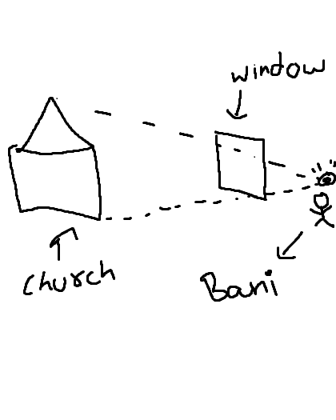
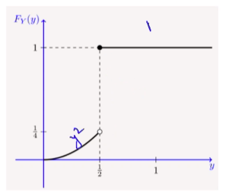

# Probability
## Distributions
### Gamma Distribution
The relation between the gamma function and the factorial function is $\Gamma(n) = (n-1)!$. It is defined as
$$\Gamma(\alpha) = \int_0^\infty x^{\alpha -1} e^{-x}dx, \alpha > 0.$$

Some properties of the gamma function are:

* $\int_0^\infty x^{\alpha-1}e^{-\lambda x} dx = \frac{\Gamma(\alpha)}{\lambda^\alpha}$
* $\Gamma(\alpha + 1) = \alpha \Gamma(\alpha)$
* $\Gamma\left(\frac12\right) = \sqrt\pi$

Now, a CRV $X$ is said to have a gamma distribution with parameters $\alpha > 0, \lambda > 0$, written $X \sim \text{Gamma}(\alpha, \lambda)$, if
$$f_X(x) = \begin{cases}
\frac{\lambda^\alpha x^{\alpha-1} e^{-\lambda x}}{\Gamma(\alpha)} & x > 0 \\
0 & \text{otherwise}. \end{cases}$$

If $\alpha = 1$, we get
$$f_X(x) = \begin{cases}
\lambda e^{-\lambda x} & x > 0 \\
0 & \text{otherwise}, \end{cases}$$

*i.e.*, $\text{Gamma}(1, \lambda) = \text{Exponential}(\lambda)$.  

Further, the sum of $n$ independent $\text{Exponential}(\lambda)$ CRVs is $\text{Gamma}(n, \lambda)$.  

Some properties of the gamma distribution are:

* $E[X] = \frac{\alpha}{\lambda}$
* $\text{Var}(X) = \frac{\alpha}{\lambda^2}$

## Mixed Random Variables
Suppose $X$ is a CRV with the PDF
$$f_X(x) = \begin{cases}
2x & 0 \leq x \leq 1 \\
0 & \text{otherwise}, \end{cases}$$

and let $Y$ be an RV such that
$$Y = g(X) = \begin{cases}
X & 0 \leq X \leq \frac12 \\
\frac12 & X \geq \frac12. \end{cases}$$

Then $Y$ is a mixed random variable. Its CDF is not continuous, but not in the staircase form either.
CDFs of mixed RVs can be written as the sum of the CDFs of a continuous and a discrete RV. In the case of $Y$, this is
$$F_Y(y) = C(y) + D(y),$$
where
$$C(y) = \begin{cases}
\frac14 & y \leq \frac12 \\
y^2 & 0 \leq y \leq \frac12 \\
0 & y < 0. \end{cases}$$
and
$$D(y) = \begin{cases}
 \frac34 & y \geq \frac12 \\
 0 & y < \frac12. \end{cases}$$

We can differentiate the continuous part to get $c(y) = \frac{dC(y)}{dy}$, wherever it is differentiable. If $\{y_1, y_2, \dots\}$ is the set of jump points of $D(y)$, then
$$\int_{-\infty}^\infty c(y) + \Sigma_{y_k} P(Y = y_k) = 1.$$
