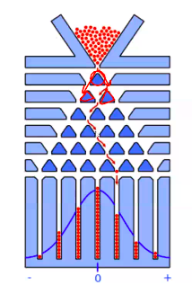

# Probability
## Galton Board

For each node, consider the number of paths leading to it. Clearly, this is equal to the sum of the number of paths leading to the two nodes above it; therefore these numbers form a Pascal's Triangle.  

Now, consider the *probability* of reaching each node of a given row (at a depth $d$). The number of paths leading to it can be found as above; call it $p$. The total number of paths leading to the row is $2^d$; therefore the probability is $\frac{d}{2^p}$.  

We know that Pascal's Triangle rows achieve their maximum value in the middle, which means that the probabilities are highest in the middle and decrease towards the sides (since the denominator is the same for all nodes in the row). Therefore we obtain the observed distribution.

## The Inclusion-Exclusion Principle
The probability of the union of a finite number of events can be calculated using this principle. It states that
$$P(A_1 \cup A_2 \cup \cdots \cup A_n) = \sum P(A_i) - \sum P(A_i \cap A_j) + $$
$$\sum P(A_i \cap A_j \cap A_k) - \cdots + (-1)^{n+1} P(A_1 \cap A_2 \cap \cdots \cap A_n).$$
